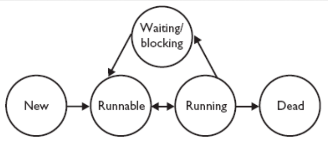

## 2.09.20

## TODO
* Почитать про исключения и их типы, которые тут есть
* 

# **Многопоточное программирование в Java**

Пакеты:
* `java.lang`
* `java.util.concurrent`

Кусок стандартной библиотеки, хорошо реализовано,
и так хорошо работает.

## Потоки

* Отдельный стек вызовов у каждого потока.
* Причем у этих потоков **ОБЩАЯ** память.

У процессов память разная. У потоков общая.
Возникают некоторые проблемы из-за этого.

* Java-поток != поток в ОС.
* У джавы свой планировщик потоков. Он привязывается (если может) 
к планировщику ОС.  
  
Много потоков, мало ядер => есть планировщик потоков, который дает время
от времени каждому потоку поработать.
Просит поток свалить, загружает новый.

Джавовские потоки привязываются к ОС потокам, если есть многопоточность. 
Иначе джава сама это делает.

**Категории потоков**:
* демоны
* пользовательские

JVM завершает выполнение программы, когда все пользовательские потоки завершат свое выполнение. 
На демонов ей пофиг, она их прибивает.


## Создание потоков

Две самые главные вещи для создания потока:
* Интерфейс `Runnable` (то, что может запускаться)
* Класс `Thread`

**Интерфейс Runnable**

Методы:
* `public void run()` - содержит стек вызовов, которые будут исполняться
в потоке.

**Класс Thread**

* Реализует интерфейс Runnable.
* Thread - поток, который будет маппиться на поток ОС.

Конструкторы:
* `Thread()`
* `Thread(Runnable target)`
* `Thread(Runnable target, String name)` - с именем проще искать и дебажить.
* `Thread(String name)`

Методы:
* `bublic void run()`
* `public void start()` - запускает поток.

**ВАЖНО**: Если хотим запустить поток, то пишем `start`. А `run` просто
запустит в текущем потоке код треда.

**Пример создания потока**:
``` Java
// Создание потока
Thread t = new Thread(new Runnable() {
    public void run() {
        System.out.println("Hello");
    }
});
// Запуск потока
t.start();
```

Плохой способ это сделать:
``` Java
// Создание потока
Thread t = new Thread() {
    public void run() {
        System.out.println("Hello");
    }
};
// Запуск потока
t.start();
```
Почему плохой:   
Если мы взяли класс и переопределили метод, то мы отнаследовались. 
1) Т.е. мы запретили классу наследоваться от чего-то еще.
2) Не можем передать один `Runnable` в неcколько потоков
(стандартная практика).

Пример сл 10:
``` Java
public class Starter {
    public static void main(String[] args) {
        NameRunnable nr = new NameRunnable();
        Thread one = new Thread(nr);
        Thread two = new Thread(nr);
        Thread three = new Thread(nr);
        one.setName("Первый");
        two.setName("Второй");
        three.setName("Третий");
        one.start();
        two.start();
        three.start();
    }
}

class NameRunnable implements Runnable {
    public void run() {
        for (int x = 1; x <= 3; x++) {
            System.out.println("Запущен " + Thread.currentThread().getName() + ", x равен " + x);
        }
    }
}
```
Что выведет?:
* Строчка не прервется посередине, т.к. `println` - блокирующая операция.
* Внутри одного потока строки упорядочены, между потоками - как угодно.
 
## Свойства потока: 
* `id` - не связан с id в ОС.
* `name` - если не задано, то генерируется JVM; несколько потоков могут
иметь одно и то же имя.
* `priority` - как часто будет потоку выдаваться время на поработать.
* `daemon` - поток-демон.   
 **ВАЖНО** После старта свойства не меняются.
 
##  Состояния потока:

**Идейно**:



`Состояние` | `Описание`
-|-
**NEW** | Состояние после создания экземпляра потока, до тех пор пока не вызван `start()`
**RUNNABLE** | Переходим в данное состояние после `start()`. Также в это состояние можно перейти после `RUNNING` И `BLOCKING`
**RUNNING** | Переходит из `RUNNABLE`, тогда планировщик потоков выбирает его из `runnable pool` как `RUNNING` в данный момент
**WAITING** **BLOCKED** **SLEEPING** | Состояния характеризуют поток как не готовый к работе
**DEAD** | Мертвый поток

t.start() : New -> Runnable   
**ВАЖНО**: Поток **НЕ** может перейти из Waiting/blocking сразу в Running!

Что происходит после thread.start():
1) Инстанс потока в ОС (сложно, долго)
2) Инициализируется стека вызовов.
3) На стек загружается точка входа в метод thread.run() и начинает
исполняться.


**С точки зрения Java**:

Состояние потока можно проверить двумя командами:
* `int getState()`
* `boolean isAlive()`

|  `getState()` | `isAlive()` |
|---------------|-------------|
| NEW           |             |
| RUNNABLE      | +           |
| BLOCKED       | +           |
| WAITING       | +           |
| TIMED_WAITING | +           |
| TERMINATED    |             |

Состояния running нет, т.к. если поток ответил на вопрос, и runnable, то 
он running **???** 
  
## **Взаимодействие с потоками:**
1. Создание потока
2. Запуск потока (`start`)
3. Ожидание окончания потока (`join`)
4. Прерывание потока (`interrupt`)
5. Засыпание потока (`sleep`)
6. Переключение потока (`yield`)

Все эти методы кидают `InterruptedException`.


### **`Sleep`**
`static void sleep(long millis)`

Если не удобно передавать время в миллисекундах, то можно использовать
` TimeUnit.SECONDS.sleep(secs/min/...)`.
* `sleep` - статический, т.е. отправляет в сон **текущий** поток !!!!!!!!!
* Отправляет поток в **TIMED_WAITING**
* Можно усыпить только свой поток! (всм, насильно, без backdoor. Другой поток усыпить нельзя).


### **Приоритеты и `yield`**
(в реальности не нужно, но на летучке могут спросить)
* Приоритет - условно, насколько часто ОС дает потоку поработать.   
* С точки зрения JVM приоритетов 10 штук. 
* У потока есть поля:
* * `static int MAX_PRIORITY` [10] - максимальный приоритет, который поток может
иметь.
* * `static int NORM_PRIORITY` [5]
* * `static int MIN_PRIORITY` [1]
* Приоритетность потоков как-то транслируется планировщику потоков ОС.
* Лучше всего использовать константы приоритетов, т.к. они хорошо транслируются
в любой ОС. Свои могут криво работать.

`void setPriority(int newPriority)` - устанавливает приоритет.

* `yield` говорит планировщику "а мб ты другой поток возьмешь?" (*Рекомендует*)
* Планировщик может согласиться или нет.
* Обычно эта команда почти никогда мгновенно не работает.

**ВАЖНО**: Нет возможности удержаться на процессоре. Можно только изначально
задать приоритет повыше.


### **`Join`**
* `void join()` -- наш поток будет ждать, пока t не завершит работу.
* `void join(long millis)` -- ожидать до завершения или истечения времени.
* `void join(long millis, int nanos)`


### **`Interrupt`**
* `interrupt()` -- **рекомендует** другому потоку закончить работу (устанавливает
флаг прерывания).


### **`InterruptedException`**
Проблема с `interrupt`: пусть есть поток, который уснул на 2 часа. Другой поток
захотел его прервать. Когда первый поток проснется, то он может как-то
отреагировать на флаг. Но 2 часа точно придется ждать. Не самый оперативный
способ связи.

Поэтому все методы, который отправляют поток на длительное ожидание, бросают
`InterruptedException`.

* Выкидывается, когда кто-то пытается прервать поток, когда он спит.
Т.е. если вызвать `myLittleThread.interrupt()`
* Может генериться случайно (т.е. **всегда надо проверять, что поток
действительно пытались прервать** через `isInterrupted()`)
* Нет общей договоренности, можно ли игнорировать `InterruptedException`.

Пример, когда исключение НЕ игнорируется:
``` Java
class Worker implements Runnable {
    public void run() {
        try {
            while (!Thread.interrupted()) {
                // Полезные действия
            }
        } catch (InterruptedException ignore) {
        }
        // Исполнение потока прервано
        // Поток заканчивает работу
    }
}
```

`InterruptedException` может появиться только в тот момент, если кто-то попытался прервать поток в тот момент, когда мы спим/ждем (`sleep`, `yield`, `join`, `wait`)


# **Синхронизация кода**

## Блокировки в Java
* Любой объект может служить блокировкой
Чтобы его сделать:
    ``` Java
    synchronized(obj) { //получение блокировки
        // some code
    } //снимает блокировку
    ```

* `synchronized` - не метод, а ключевое слово
* Снятие блокировки (в любом случае) производится автоматически
* Если `obj` занят (т.е. кто-то вызвал на нем synchronized), то текущий
поток переходит в состояние BLOCKED и ждет, пока объект не освободится.
* `synchronized` не позволяет сделать какую-то другую задачу, если поток ждет
ресурс (но есть другие штуки, которые позволяют).
* Можно сделать метод ЭКЗЕМПЛЯРА синхронизированным:
    ``` Java
    public synchronized int getValue() { ... }
    ```

* Эквивалентно (почти, потому что `JIT` компиллятору проще оптимизировать первое)
    ``` Java
    public int getValue() {
        synchronized (this) { ... }
    }
    ```

* Можно сделать метод КЛАССА синхронизированным:
    ``` Java
    class Example {
        public static synchronized int getValue() { ... }
    ```

* Эквивалентно (почти)
    ``` Java
    public int getValue() {
        synchronized (Example.class) { ... }
    }
    ```

**NB:** Синхронизованные методы нельзя запускать одновременно.

**ВАЖНО:** При вызове `yeild`, `synchonized`, `join` поток **УДЕРЖИВАЕТ
ВСЕ** свои блокировки.

Пример:
``` Java
synchronized(o) {
    this.sleep(10000)
    // пока поток спит, никто другой не сможет взять блокировку
}
```

### **Как работает планировщик потоков**

Очень приближенно. Поток - это книжка. Эти книжки лежат в стопке. Планировщик
читает верхнюю книгу. Если он читает ее долго (1000 мсек), то он ее закрывает,
кладет вниз и открывает верхнюю. Перед тем как начать ее читать, он проверяет,
есть ли у нее все необходимые блокировки. Если есть, то он ее запускает. Если
нет, то он проверяет, можно ли захватить все необходимые блокировки. Если да,
то захватывает, иначе кидает ее вниз.


## Несколько многопоточных паттернов проектирования

### Паттерн "Производитель-потребитель"

* есть один или несколько потоков, которые производят данные (производители).
Они складывают данные в очередь.
* один или несколько потоков, которые потребляют данные. Они забирают данные из
очереди.

Будем рассматривать пример с n производителей, m потребителей, очередь размера 1.

В чем проблема:
* много производителей => производителю надо ждать, чтобы положить данные в
очередь.
* потребителю надо сидеть и ждать, пока что-то появится в очереди

> Q: Что будет, если не убить поток-потребитель? Он будет вечно ждать?
> A: Да. Это, например, как чтение из консоли. Если мы не прервем программу,
> то будем вечно ждать нового сообщения.

### **Реализация методов**
**Интерфейс очереди:**
``` Java
class Queue {
    private Object data;
    public void set(Object data) {}
    public Object get() {}
}
```

**Установка значения**
``` Java
public void set(Object data) {
    while (true) {
        synchronized(this) {
            if (this.data == null) {
                this.data = data;
                break;
            }   
        }   
    }
}
```
Комментарии: если поменять `while` и `synchronized` местами, то все сломается.
Не можем выйти из цикла, пока кто-то не заберет объект из очереди. Но объект
можно забрать, только если он не заблокирован, а он заблокирован.

Спойлер: этот код - говно. Почему?
1) Если производителей много, то они все будут крутиться в ожидании своей очереди
на выкладывание данных. Это затратно.   
Лучше сделать что-то в стиле "усни, пока не заберут данные из очереди".
2) Этот код долгий. В начале каждой итерации цикла захватываем, а потом
освобождаем блокировку.   
* Захват блокировки - тяжелая операция. Для этого надо выйти за пределы своего
потока, обратиться к менеджеру потоков, с ним пообщаться, мб еще уснуть.   
* Отдача блокировки - тоже тяжелая операция.

**Получение значения**

```java
public Object get() {
    while (true) { // Активное ожидание
        synchronized(this) {
            if (this.data != null) {
                Object d = this.data;
                this.data = null;
                return d;
            }   
        }   
    }
}
```


# **Мониторы и условия**

В классе `Object` есть 3 метода для общения между потоками:
* `wait(time?)` - ожидание. При ожидании **БЛОКИРОВКА СНИМАЕТСЯ**.   
> Поток в соcтоянии Running. Когда поток засыпает, он запоминает все блокировки,
которыми владел, и отпускает их. Переходит в состояние Waiting. Когда он
просыпается, то ему надо захватить обратно все блокировки. Переход в состояние
Blocking. Когда он захватил все блокировки обратно, он готов к работе (состояние
Runnable).
* `notify()` - извещение одно (случайного) из ждущих потоков. **НЕ СНИМАЕТ БЛОКИРОВКУ**.
* `notifyAll()` - извещение всех ждущих потоков. **НЕ СНИМАЕТ БЛОКИРОВКУ**.

**ВАЖНО**:
* Нельзя делать эти методы без блокировки (иначе `java.lang.IllegalMonitorStateException`)
* Бросают `IllegalMonitorStateException`.
* Возможно внезапное пробужение (т.е. без `notify()`). Поэтому все `wait()`
надо делать в цикле:
  ``` Java
  while (условие) {
      wait();
  }
  ```

Другие версии методов:
```java
public synchronized void set(Object data) throws InterruptedException {
    while (this.data != null) {
        this.wait(); // Пассивное лжидание
    }
    this.data = data;
    this.notify();
}

public synchronized Object get() throws InterruptedException {
    while (data == null) {
        wait(); // пассивное ожидание
    }
    Object d = data;
    data = null;
    notify();
    return d;
}
```

**Проблема:** функция `notify()` уведомляет КОГО-ТО. Это может быть другой
производитель. И мы не знаем, кого она разбудит.

**Решение:** будим всех. На самом деле, тоже не самое хорошее решение, т.к. **???**
Но пока будем делать так.

``` Java
public synchronized void set(Object data) {
    while (this.data != null) {
        this.wait();
    }
    this.data = data;
    notifyAll();
}

public synchronized Object get() {
    while (data == null) {
        wait();
    }
    Object d = this.data;
    this.data = null;
    notifyAll();
    return d;
}
```

**Политики передачи блокировки**:
* честная (получает блокировку тот, кто пришел первый)
* случайная


### Паттерн Задания-Работники
Отличие от паттерна Производитель-потребитель: Задание хочет получить обратно
какой-то ответ о выполнении или результат.

Решение с помощью монитора:
#### Задание:
``` C++
sync(task) {
    sync(queue) {
        queue.add(task);
        queue.notifyAll();
    }
    task.wait();
}
```

#### Работник
``` C++
sync(queue) {
    while (queue.isEmpty()) {
        queue.wait();
    }
    Task t = queue.get();
}
t.notify();
```

Тут нет проблемы с тем, что мы разбудим кого-то не того: разные сущности сидят
в ожидании по разным объектам (очередь, таска).